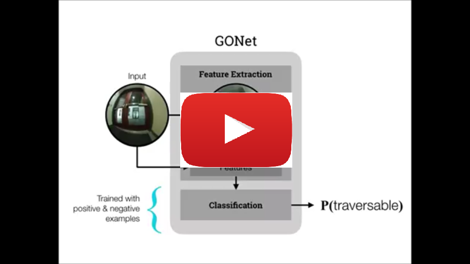

# GONet: A Semi Supervised Deep Learning Approach For Traversability Estimation
 
**Summary**: Safety is one of the most important topics for the real robot in the real environment. GONet can estimate the traversable probability from the fish eye camera image to avoide the collision. Main contributions of our method is followings,

**I.** Needlessness of the huge annotated untraversable images, which is very hard to collect,  
**II.** Cheaper and stronger estimation than the method using depth information,   
**III.** Realease of our new dataset(http://cvgl.stanford.edu/gonet/dataset/).

Although our method doesn't need the huge annotated untraversable images, the high accuracy can be achieved by a semi supervised deep learning approach based on GAN(Generative Adversarial Network).
Please see the [website](http://cvgl.stanford.edu/gonet/) (http://cvgl.stanford.edu/gonet/) for more technical details. This repository is intended for distribution of the code and its instruction.

#### Paper
**["GONet A Semi Supervised Deep Learning Approach For Traversability Estimation"](http://cvgl.stanford.edu/gonet/)**, in **IROS 2018 [Best Paper Award Finalist on Safety, Security, and Rescue Robotics]**.


[](https://youtu.be/SmVsGQ2-dlM "Click to watch the video summarizing Gibson environment!")


System Requirement
=================
Ubuntu 16.04

Chainer 4.1.0

Python Pillow 1.1.7

ROS KINETIC(http://wiki.ros.org/kinetic)

Nvidia GPU


Database
=================
Our dataset "GO Stanford" to train GONet is opened at http://cvgl.stanford.edu/gonet/dataset/.

How to use GONet
=================

#### Step1: Choose the method
We have following 4 options to estimate the traversable probability, depending on your setup. 

GONet.py : core GONet using the monocular vision. We can freely choose the frame rate of GONet.

GONet_T.py : GONet-t using the monocular vision with considering the time consistency by LSTM. We recommend to run GONet-t at 3 fps.

GONet_S.py : GONet-s using the stereo vision. We can freely choose the frame rate of GONet-s.

GONet_TS.py : GONet-ts using the stereo vision with considering the time consistency by LSTM. We recommend to run GONet-ts at 3 fps.

The accuracy in the test dataset is GONet-ts(96.90%) > GONet-s(94.90%) > GONet-t(94.45%) > GONet(92.55%).

#### Step2: Download
git clone https://github.com/NHirose/GONET.git

#### Step3: Camera Setup
GONet can only accept the fish eye camera image to capture the environment in front of the robot.
And, we highly recommend to use RICOH THETA S, because the training and the evaluation of GONet are done by the collected images by RICOH THETA S.(https://theta360.com/en/about/theta/s.html)
Please put the camera in front of your device(robot) at the height 0.460 m not to caputure your device itself and connect with your PC with USB cable. The distance of two cameras can be 0.115 m, if you would like to apply GONet-s or GONet-ts using the stereo vision.

#### Step4: Image Capturing
To turn on RICOH THETA S as the live streaming mode, please hold the bottom buttom at side for about 5 senconds and push the top buttom.(Detail is shown in the instrunction sheet of RICOH THETA.)

To capture the image from RICOH THETA S, we used the open source in ROS, cv_camera_node(http://wiki.ros.org/cv_camera).
For the core GONet and GONet-t using the monocular vision, the published topic name of the image is "/cv_camera_node/image_raw".
For the GONet-s and GONet-ts using the stereo vision, the published topic name of the image are "/cv_camera_node1/image_raw" and "/cv_camera_node1/image_raw".

#### Step5: Runing GONet
The last process to get the traversable probability is just to run our algorithm.

python GONet???.py

The published topic for the traversable probablity is "out_GONet".


Citation
=================

If you use GONet's software or database, please cite:
```
@article{hirose2018gonet,
  title={GONet: A Semi-Supervised Deep Learning Approach For Traversability Estimation},
  author={Hirose, Noriaki and Sadeghian, Amir and V{\'a}zquez, Marynel and Goebel, Patrick and Savarese, Silvio},
  booktitle={Intelligent Robots and Systems (IROS), 2018 IEEE/RSJ International Conference on},
  pages={3044--3051},
  year={2018},
  organization={IEEE}
}
```
or
```
@article{hirose2018gonet,
  title={GONet: A Semi-Supervised Deep Learning Approach For Traversability Estimation},
  author={Hirose, Noriaki and Sadeghian, Amir and V{\'a}zquez, Marynel and Goebel, Patrick and Savarese, Silvio},
  journal={arXiv preprint arXiv:1803.03254},
  year={2018}
}
```


